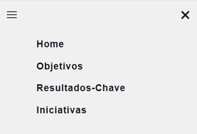
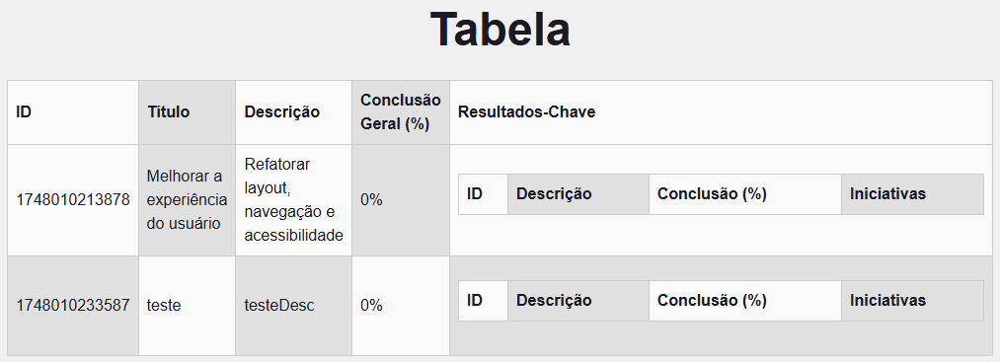

# Documentação do código: 

## Sumário
* [Integração com back-end ](#integracao)
    * [Exemplo do controller no Back-end](#back)
    * [Exemplo da requisição no Front-end](#front)
* [Components](#components)
* [Pagina de Consulta Exemplo ](#consulta)
* [Pagina de Criação Exemplo ](#criacao)
* [Pagina de Atualização Exemplo ](#atualizacao)
* [Iniciativas](#iniciativas)
* [Resultados-Chave](#kr)
* [global.css + layout](#global)
* [page](#page)
* [Autoras](#autoras)


<div id='estrutura'>

## Estrutura do código: 
```
>src/app
|
|------>componentes
        |
        |->Sidebar 
            |_Sidebar.module.css
            |_Sidebar.tsx
        |
        |->Table
            |_Table.module.css
            |_Table.tsx
        |
        |->ToggleButton
            |_ToggleButton.module.css
            |_ToggleButton.tsx
|
|------>iniciativas
        |
        |->atualizar-iniciativas
            |
            |_atualizar-iniciativas.module.css
            |_page.tsx
        |
        |->consultar-iniciativas
            |
            |_consultar-iniciativas.module.css
            |_page.tsx
        |
        |->criar-iniciativas
            |
            |_criar-iniciativas.module.css
            |_page.tsx
        |
        |_iniciativas.module.css
        |
        |_page.tsx
|
|------>objetivos
        |
        |->atualizar-objetivos
            |
            |_atualizar-objetivos.module.css
            |_page.tsx
        |
        |->consultar-objetivos
            |
            |_consultar-objetivos.module.css
            |_page.tsx
        |
        |->criar-objetivos
            |
            |_criar-objetivos.module.css
            |_page.tsx
        |
        |_objetivos.module.css
        |
        |_page.tsx
|
|------>resultados-chave
        |
        |->atualizar-resultados-chave
            |
            |_atualizar-resultados-chave.module.css
            |_page.tsx
        |
        |->consultar-resultados-chave
            |
            |_consultar-resultados-chave.module.css
            |_page.tsx
        |
        |->criar-resultados-chave
            |
            |_criar-resultados-chave.module.css
            |_page.tsx
        |
        |_resultados-chave.module.css
        |
        |_page.tsx
|
|------>globals.css
|
|------>layout.tsx
|
|------>page.module.css
|
|------>page.tsx
```

</div>

<div id='integracao'/> 

## Integração com back-end 
Para o back-end aceitar a requisição da API de um front-end, utilizamos o `@CrossOrigin(origins = "*")` nos controllers, porque o navegador tyem uma política de same-origin, que bloqueia automaticamente as requisições entre esses domínios diferentes por motivos de segurança. O `@CrossOrigin` remove essa restrição.

 O  `@CrossOrigin(origins = "*")` é uma anotação do Spring Framework Java que permite solicitações entre origens diferentes (cross-origin) a um endpoint específico do nosso back-end. O parâmetro `origins = "*"` permite acesso de qualquer origem.

<div id='back'>

* ### Exemplo do controller no Back-end:

```java

@RestController
@CrossOrigin(origins = "*")
@RequestMapping("/objetivos")
public class ObjetivoController {
    private final ObjetivoService objetivoService;

    public ObjetivoController(ObjetivoService objetivoService, ObjetivoRepository objetivoRepository) {
        this.objetivoService = objetivoService;
    }
...
}

```
</div>
<div id='front'>

* ### Exemplo da requisição no Front-end:

   ```javascript
   const fetchAllObjetivos = () => {
    fetch('https://reimagined-eureka-97qvj654xg4rc9p6v-8080.app.github.dev/objetivos')
      .then((res) => res.json())
      .then((res) => {
        const objetivos = Array.isArray(res) ? res : [res]; // se a resposta n for um array, coloca dentro de um array

        //para cada obj, garante que kr e iniciativa seja um array
        const normalized = objetivos.map((obj) => ({
          ...obj,
          krs: Array.isArray(obj.krs) ? obj.krs.map((kr: any) => ({
            ...kr,
            iniciativas: Array.isArray(kr.iniciativas) ? kr.iniciativas : [],
          })) : [],
        }));
        setData(normalized);
      })
      .catch(console.error);
  };
   ```

   Nesse trecho de código da função `fetchAllObjetivos`, a requisição acontece da seguinte maneira:

   1- `fetch()` faz uma chamada GET para o endpoint `/objetivos` do back-end
    * Recebe a requisição do front-end
    * Verifica o cabeçalho `Origin`
    * Se permitido pelo `@CrossOrigin`, processa e retorna a resposta com cabeçalho adequado

   2- O primeiro`.then()` converte a resposta em JSON

   3- O segundo `.then()` processa os dados recebidos

   4- O `.catch(console.error)` captura e exibe no console qualquer erro que tenha ocorrido durante a requisição

</div>


<div id='components'>

## Components
A componentização é utilizada para evitar a repetição de trechos de códigos de elementos que serão utilizados em multiplas páginas. No contexto do nosso projeto, decidimos componentizar a estilização e a estrutura dos seguintes elementos: 

* ### Sidebar:

   - Menu lateral responsivo que pode ser expandido/recolhido
   - Navegação entre as seções principais (Objetivos, Resultados-Chave, Iniciativas)
   - Estilização com CSS Modules para isolamento de estilos
     
   A Sidebar é composta pelos arquivos `Sidebar.tsx` e `Sidebar.module.css`. No arquivo `.tsx` estão presentes o botão hamburguer, para expandi-la, o `<nav>` que possui uma lista de tags `<Link>` importada do 'next/link', os quais são responsáveis por redirecionar para outras páginas. Já no arquivo `.module.css` estão as classes de estilização dos elementos presentes no arquivo `.tsx`.

   - visualização: 

    


* ### Table: 

   - Componente reutilizável para exibição tabular de dados
   - Suporta aninhamento para mostrar relações hierárquicas (Objetivos → KRs → Iniciativas)
   - Estilização alternada de linhas para melhor legibilidade
   - Estilos alternados (`.light`/`.dark`) entre os campos da tabela. 
     
   A Table é composta pelos arquivos `Table.tsx` e `Table.module.css`. No arquivo `.tsx` estão presentes as tags `<table>`, `<thead>` e `<tbody>` que possui as tags `<tr>` dentro, os quais são responsáveis pelas linhas e colunas de uma tabela. 

   A tabela recebe duas props que definirão os dados e as colunas da tabela criada, se adaptando dinamicamente ao contexto de ojetivos, resultados-chaves e iniciativas, os quais possuem diferentes quantidades de atributos, o que altera a quantidade de linhas e colunas das tabelas.


   - visualização: 
    


* ### ToggleButton

   - Componente para alternar estados (usado para expandir/recolher seções)
   - Integrado com o sistema de temas (claro/escuro)

</div>
<div id='consulta'>

## Páginas de Consulta:


A página ConsultarObjetivos é a interface principal para visualização e busca de objetivos no sistema, apresentando os dados tanto em formato de cards interativos, a fim de uma melhor esperiência de usuário, quanto em tabela hierárquica.

* Barra de pesquisa com filtros por diferentes campos
  - Filtragem por diferentes campos (título, descrição, porcentagem ou ID)
   - Validação para evitar pesquisas sem campo selecionado
   - Botão de busca que aciona a requisição à API

     ```tsx
         const handleSearch = () => {
        let url = baseUrl;
        
        switch(searchField) {
          case 'titulo': url += `/titulo/${term}`; break;
          case 'desc': url += `/desc/${term}`; break;
          case 'porcentagem': url += `/porcentagem/${term}`; break;
          case 'id': url += `/${term}`; break;
        }
      
        fetch(url)
          .then(/* ... */)
          .then(/*normalização */)
          .then(setData);
      };
     ```
     
* Visualização alternativa em tabela hierárquica
     - utilizacção do componente Table
  
* Visualização em cards interativos com:
   - Seções expansíveis para KRs e Iniciativas
   - Indicadores visuais de progresso (porcentagens)
   - Design responsivo que se adapta a diferentes tamanhos de tela


   ```tsx
      <div className={styles.cardContainer}>
     {data.map((obj) => (
       <div key={obj.id} className={styles.objetivoCard}>
         {/* Conteúdo do objetivo */}
         {obj.krs.map((kr) => (
           <div key={kr.id} className={styles.krCard}>
             {/* Conteúdo do KR */}
             {isExpanded && (
               <div className={styles.iniciativasContainer}>
                 {/* Iniciativas expandidas */}
               </div>
             )}
           </div>
         ))}
       </div>
     ))}
   </div>
   ```
</div>

<div id='criacao'>

## Páginas de Criação:


A página CriarObjetivos permite aos usuários cadastrar novos objetivos no sistema através de um formulário simples e intuitivo, com integração direta à API back-end.

* Estados do Componente:
   - Controla os campos do formulário (título e descrição)
   - Inicializados como strings vazias 

```
const [titulo, setTitulo] = useState('');
const [desc, setDesc] = useState('');
```
  
* Estrutura do Formulário:
   - Dois campos obrigatórios (título e descrição)
   - Validação HTML5 (required)
   - Estilização via CSS Modules

* Link de Navegação 
   - Redireciona para a página de consulta
 
* Submissão do formulário:

   - código

 ```typescript

        const handleSubmit = async (e: React.FormEvent) => {
        e.preventDefault();
      
        const novoObjetivo: Objetivo = {
          id: Date.now(), // ID temporário
          titulo,
          desc,
        };
      
        try {
          const response = await fetch(API_URL + '/objetivos', {
            method: 'POST',
            headers: { 'Content-Type': 'application/json' },
            body: JSON.stringify(novoObjetivo),
          });
      
          if (!response.ok) throw new Error('Erro ao enviar dados');
      
          // Reset do formulário
          setTitulo('');
          setDesc('');
      
          alert('Objetivo criado com sucesso!');
        } catch (error) {
          console.error('Erro ao enviar dados:', error);
          alert('Erro ao criar objetivo');
        }
      };

```
     
1 - Previne comportamento padrão do formulário

2 - Cria objeto Objetivo com:

   - 2.1 - ID gerado temporariamente (timestamp)
   
   - 2.2 - Título e descrição dos estados
   
3 - Envia requisição POST para a API

4 - Trata resposta:

   - 4.1 - Sucesso: Limpa formulário e exibe alerta
   
   - 4.2 - Erro: Log no console e alerta usuário
     
</div>

<div id ='atualizacao'>

### Páginas de Atualização:


   A página AtualizarObjetivos permite a edição e exclusão de objetivos existentes no sistema, com seções colapsáveis para cada operação e integração completa com a API back-end.

* Estados do Componente
  
   ```typescript
      // Estados para deleção
      const [idToDelete, setIdToDelete] = useState<string>('');
      const [deleteMsg, setDeleteMsg] = useState<string>('');

      // Estados para dados
      const [objetivos, setObjetivos] = useState<Objetivo[]>([]);
      const [selectedId, setSelectedId] = useState<number | null>(null);
      
      // Estados para formulário
      const [titulo, setTitulo] = useState('');
      const [desc, setDesc] = useState('');
      
      // Estados para UI
      const [showDelete, setShowDelete] = useState(false);
      const [showUpdate, setShowUpdate] = useState(false);

   ```
* Seção de Exclusão
  A seção de exclusão remove permanentemente objetivos com um fluxo seguro:

   1- Seleção do Objetivo:
      - Dropdown similar ao de atualização
      - Exige seleção explícita

   2- Confirmação Dupla:
      - Popup de confirmação nativo do navegador
      - Prevenção contra exclusões acidentais

   3- Execução:
      - Requisição DELETE para a API
      - Atualização automática da lista
      - Mensagem de status persistente

  ```tsx
  
  <button className={styles.collapsible} onClick={() => setShowDelete((prev) => !prev)}>
     Apagar Objetivo
   </button>
   {showDelete && (
     <div className={styles.content}>
       {/* Seletor de objetivo */}
       <button onClick={handleDelete}>Apagar</button>
     </div>
   )}

   ```
  * Fluxo de exclusão de um objetivo
    
    ``` typescript
         const handleDelete = async () => {
           if (!idToDelete.trim()) return;
           
           try {
             const response = await fetch(`${API_URL}/objetivos/${idToDelete}`, {
               method: 'DELETE'
             });
             // Tratamento da resposta
           } catch {
             // Tratamento de erro
           }
         };
    ```
  
* Seção de Atualização
  A seção de atualização permite modificar objetivos existentes através de um fluxo em três etapas:

1- Seleção do Objetivo:
   - Um dropdown lista todos os objetivos disponíveis (ID + Título)
   - Ao selecionar, os campos são automaticamente preenchidos com os dados atuais

2- Edição dos Campos:
   - Formulário com título e descrição editáveis
   - Validação em tempo real (campos obrigatórios)

3- Confirmação:
   - Envio via requisição PUT para a API
   - Atualização da lista após sucesso
   - Feedback visual (alertas de sucesso/erro)

  ```tsx
      <button className={styles.collapsible} onClick={() => setShowUpdate((prev) => !prev)}>
        Atualizar Objetivo
      </button>
      {showUpdate && (
        <div className={styles.content}>
          {/* Seletor e formulário */}
          <form onSubmit={handleUpdate}>
            {/* Campos do formulário */}
          </form>
        </div>
      )} 
  ```

  * Fluxo de Atualização de um objetivo
 
    ```typescript
         const handleUpdate = async (e: React.FormEvent) => {
           e.preventDefault();
           
           const updatedObjetivo = {
             id: selectedId,
             titulo,
             desc
           };
         
           try {
             const response = await fetch(`${API_URL}/objetivos/${selectedId}`, {
               method: 'PUT',
               headers: { 'Content-Type': 'application/json' },
               body: JSON.stringify(updatedObjetivo)
             });
             // Tratamento da resposta
           } catch {
             // Tratamento de erro
           }
         };
    ```

</div>

<div id='kr'>

## Resultados-Chave

* visualização:


* visualização:


* visualização:


</div>

<div id='iniciativas'>

## Iniciativas

* visualização:


* visualização:


* visualização:


</div>

<div id='global'>

## CSS Global e Layout

   O arquivo `globals.css` possui a estilização que estará presente em todas as páginas do site. Ele possui as variáveis `background` e `foreground` usadas para definir as cores da fonte e do fundo, além dos estilos definidos para o título e a fonte.

```css
:root {
   --background: #f0f0f0;
   --foreground: #1A1A24;
}
```
```css
body {
  background: var(--background);
  color: var(--foreground);
  font-family: Arial, Helvetica, sans-serif;
}
```

   No arquivo `layout.tsx` são colocados os elementos que farão parte da estrutura de todas as páginas do site, como a fonte utilizada e os elementos fixos na tela, como os componentes `Sidebar` e `ToggleButton`. Os metadados como o título e descrição das páginas também estão presentes no layout.

```tsx
export default function RootLayout() {
  return (
    <html>
      <body
        className={`${geistSans.variable} ${geistMono.variable} antialiased`}
      >
        {children}
        <Sidebar />
        <ToggleButton />
      </body>
    </html>
  );
}
```

</div>
<div id='page'>

## Tela Inicial

   A tela inicial é composta pelos arquivos `page.tsx` e `page.module.css`. O arquivo `.tsx` tem como conteúdo o título, um menu de navegação para as páginas de Objetivos, Resultados-Chave e Iniciativas e um parágrafo de contextualização do site.

```tsx
export default function Home() {
  return (
    <div className={styles.container}>
      <h1>Sistema Simplificado de Gestão de OKRs</h1>
      <div className={styles.content}>
        // Conteúdo da página
      </div>
    </div>
  );
}
``` 

   Já o arquivo CSS `.module.css` possui as classes de estilização dos elementos da página, além de suporte para modo claro e escuro.

```css
.menuButton {
  padding: 10pt 20pt;
  background-color: #e2732e;
  color: white;
  border-radius: 8px;
  text-decoration: none;
  transition: background-color 0.2s;
}
[data-theme="dark"] .menuButton {
  background-color: #e37741;
}
```

</div>

<div id='autoras'>

## Autoras
* Carolina Sun Ramos Nantes de Castilho
* Millie Talala Zogheib

</div>
