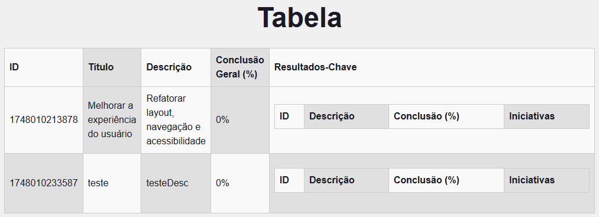

# Documentação do código: 

## Sumário
* [Integração com back-end ](#integracao)
    * [Exemplo do controller no Back-end](#back)
    * [Exemplo da requisição no Front-end](#front)
* [Components](#components)
* [Objetivos](#obj)
* [Iniciativas](#iniciativas)
* [Resultados-Chave](#kr)
* [global.css + layout](#global)
* [page](#page)
* [Autoras](#autoras)


<div id='integracao'/> 


## Integração com back-end 
Para o back-end aceitar a requisição da API de um front-end, utilizamos o `@CrossOrigin(origins = "*")` nos controllers, porque o navegador tyem uma política de same-origin, que bloqueia automaticamente as requisições entre esses domínios diferentes por motivos de segurança. O `@CrossOrigin` remove essa restrição.

 O  `@CrossOrigin(origins = "*")` é uma anotação do Spring Framework Java que permite solicitações entre origens diferentes (cross-origin) a um endpoint específico do nosso back-end. O parâmetro `origins = "*"` permite acesso de qualquer origem.

<div id='back'>

* ### Exemplo do controller no Back-end:

```java

@RestController
@CrossOrigin(origins = "*")
@RequestMapping("/objetivos")
public class ObjetivoController {
    private final ObjetivoService objetivoService;

    public ObjetivoController(ObjetivoService objetivoService, ObjetivoRepository objetivoRepository) {
        this.objetivoService = objetivoService;
    }
...
}

```
</div>
<div id='front'>

* ### Exemplo da requisição no Front-end:

   ```javascript
   const fetchAllObjetivos = () => {
    fetch('https://reimagined-eureka-97qvj654xg4rc9p6v-8080.app.github.dev/objetivos')
      .then((res) => res.json())
      .then((res) => {
        const objetivos = Array.isArray(res) ? res : [res]; // se a resposta n for um array, coloca dentro de um array

        //para cada obj, garante que kr e iniciativa seja um array
        const normalized = objetivos.map((obj) => ({
          ...obj,
          krs: Array.isArray(obj.krs) ? obj.krs.map((kr: any) => ({
            ...kr,
            iniciativas: Array.isArray(kr.iniciativas) ? kr.iniciativas : [],
          })) : [],
        }));
        setData(normalized);
      })
      .catch(console.error);
  };
   ```

   Nesse trecho de código da função `fetchAllObjetivos`, a requisição acontece da seguinte maneira:

   1- `fetch()` faz uma chamada GET para o endpoint `/objetivos` do back-end
    * Recebe a requisição do front-end
    * Verifica o cabeçalho `Origin`
    * Se permitido pelo `@CrossOrigin`, processa e retorna a resposta com cabeçalho adequado

   2- O primeiro`.then()` converte a resposta em JSON

   3- O segundo `.then()` processa os dados recebidos

   4- O `.catch(console.error)` captura e exibe no console qualquer erro que tenha ocorrido durante a requisição

 

</div>


<div id='estrutura'>

## Estrutura do código: 
```
>src/app
|
|------>componentes
        |
        |->Sidebar 
            |_Sidebar.module.css
            |_Sidebar.tsx
        |
        |->Table
            |_Table.module.css
            |_Table.tsx
        |
        |->ToggleButton
            |_ToggleButton.module.css
            |_ToggleButton.tsx
|
|------>iniciativas
        |
        |->atualizar-iniciativas
            |
            |_atualizar-iniciativas.module.css
            |_page.tsx
        |
        |->consultar-iniciativas
            |
            |_consultar-iniciativas.module.css
            |_page.tsx
        |
        |->criar-iniciativas
            |
            |_criar-iniciativas.module.css
            |_page.tsx
        |
        |_iniciativas.module.css
        |
        |_page.tsx
|
|------>objetivos
        |
        |->atualizar-objetivos
            |
            |_atualizar-objetivos.module.css
            |_page.tsx
        |
        |->consultar-objetivos
            |
            |_consultar-objetivos.module.css
            |_page.tsx
        |
        |->criar-objetivos
            |
            |_criar-objetivos.module.css
            |_page.tsx
        |
        |_objetivos.module.css
        |
        |_page.tsx
|
|------>resultados-chave
        |
        |->atualizar-resultados-chave
            |
            |_atualizar-resultados-chave.module.css
            |_page.tsx
        |
        |->consultar-resultados-chave
            |
            |_consultar-resultados-chave.module.css
            |_page.tsx
        |
        |->criar-resultados-chave
            |
            |_criar-resultados-chave.module.css
            |_page.tsx
        |
        |_resultados-chave.module.css
        |
        |_page.tsx
|
|------>globals.css
|
|------>layout.tsx
|
|------>page.module.css
|
|------>page.tsx
```

</div>

<div id='components'>

## Components
A componentização é utilizada para evitar a repetição de trechos de códigos de elementos que serão utilizados em multiplas páginas. No contexto do nosso projeto, decidimos componentizar a estilização e a estrutura dos seguintes elementos: 

* ### Sidebar:

A Sidebar é composta pelos arquivos `Sidebar.tsx` e `Sidebar.module.css`. No arquivo `.tsx` estão presentes o botão hamburguer, para expandi-la, o `<nav>` que possui uma lista de tags `<Link>` importada do 'next/link', os quais são responsáveis por redirecionar para outras páginas. Já no arquivo `.module.css` estão as classes de estilização dos elementos presentes no arquivo `.tsx`.

    * código da estrutura: 

``` tsx
<nav className={`${styles['nav-menu']} ${isOpen ? styles.open : ""}`} >
        <button className={styles['nav-button']} onClick={() => setIsOpen(false)}> × </button>
        <ul className={styles['nav-list']}>
          <Link href="/">
            <li className={styles['nav-item']}>Home</li>
          </Link>
          <Link href="/objetivos">
            <li className={styles['nav-item']}>Objetivos</li>
          </Link>
          <Link href="/resultados-chave">
            <li className={styles['nav-item']}>Resultados-Chave</li>
          </Link>
          <Link href="/iniciativas">
            <li className={styles['nav-item']}>Iniciativas</li>
          </Link>
        </ul>
      </nav>
```

    * código da estilização: 
```css
.nav-menu {
  position: fixed;
  top: 0;
  left: 0;
  height: 100%;
  max-width: 100%;
  width: 100%;
  transform: translateX(-100%);
  transition: transform 0.3s ease-in-out;
  z-index: 40;
  background: inherit;
}
```

    * visualização: 

    


* ### Table: 

A Table é composta pelos arquivos `Table.tsx` e `Table.module.css`. No arquivo `.tsx` estão presentes as tags `<table>`, `<thead>` e `<tbody>` que possui as tags `<tr>` dentro, os quais são responsáveis pelas linhas e colunas de uma tabela. 

A tabela recebe duas props que definirão os dados e as colunas da tabela criada, se adaptando dinamicamente ao contexto de ojetivos, resultados-chaves e iniciativas, os quais possuem diferentes quantidades de atributos, o que altera a quantidade de linhas e colunas das tabelas.


Já no arquivo `.module.css` estão as classes de estilização dos elementos presentes no arquivo `.tsx`. A tabela possui uma lógica que aplica estilos alternados (`.light`/`.dark`) entre os campos da tabela. 


    * visualização: 
    

     

* ### ToggleButton

</div>
<div id='obj'>

## Objetivos  
//trechos de código consultar, atualizar, criar + css

</div>
<div id='iniciativas'>

## Iniciativas
//trechos de código consultar, atualizar, criar + css

</div>
<div id='kr'>

## Resultados-Chave
//trechos de código consultar, atualizar, criar + css

</div>
<div id='global'>

## global.css + layout

</div>
<div id='page'>

## page 
// css + tsx

</div>

<div id='autoras'>

## Autoras
* Carolina Sun Ramos Nantes de Castilho
* Millie Talala Zogheib

</div>
